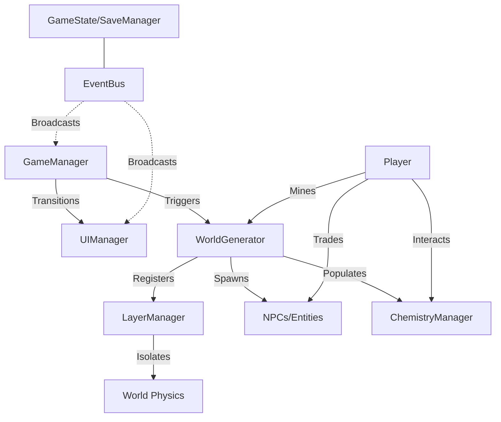

# Design: Unified Architecture Skeleton

This document outlines the high-level architecture of the 2D Sandbox Game, detailing how systems are layered and linked.

## 1. Core Orchestration (The "Skeleton")

## 2. System Linkage & Data Flow

### A. Environment Linkages
- **WorldGenerator -> LayerManager**: The generator creates three `TileMapLayer` nodes (Surface, Underground, Deep). It tells `LayerManager` which physics layer corresponds to which world depth.
- **ChemistryManager -> TileMap**: Simulation reads tile metadata (from `TileSet`) to determine if a block is flammable or liquid. It applies changes directly back to the `TileMap`.

### B. Entity Linkages
- **NPC -> SettlementManager**: Each NPC spawned in a village is registered with the `SettlementManager`. This manager tracks the "Health" of the village based on its residents and buildings.
- **Player -> Combat/Spell System**: The player's active Wand (Noita mechanics) pulls `SpellCard` resources from the `Inventory`. The `ChemistryManager` listens for "Impact" signals to trigger elemental reactions.

### C. UI & Economy
- **UIManager**: A stack-based system. `HUD` remains at the bottom, while `Inventory`, `Trading`, and `Dialogue` push/pop on top.
- **Trading -> ItemDB**: All transactional systems reference a centralized `item_db` in `GameState` to ensure price and description consistency.

## 3. The "Simulation Window" (Scale Management)
With a 1000x500 world, the architecture uses a "Windowed Update" pattern:
- **ChemistryManager**: Only updates tiles within a 128x128 radius of the player.
- **NPC AI**: Processes `WANDER` state locally, but switches to simplified "Sleep" mode if far from the player.

## 4. Hierarchy of Systems (The Integration Stack)
1.  **Level 0 (Autoloads)**: `EventBus`, `GameState`, `SaveManager`, `LayerManager`.
2.  **Level 1 (World Context)**: `WorldGenerator`, `ChemistryManager`, `WeatherManager`.
3.  **Level 2 (Active Entities)**: `Player`, `NPCs`, `LootItems`.
4.  **Level 3 (UI/Feedback)**: `UIManager`, `BackgroundController`.
