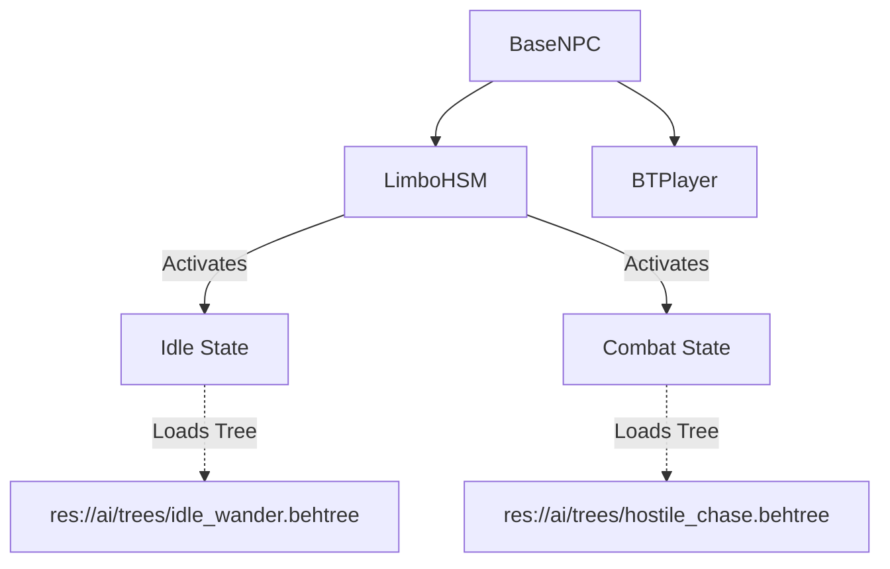

# Design: NPC Behavior Architecture

## 1. Hybrid Architecture (HSM + BT)

We use a "State-Driven Behavior Tree" approach. The `LimboHSM` node controls the high-level context (Is the NPC calm? Is it fighting?), while the `BTPlayer` executes the micro-actions.

### Structure

## 2. Blackboard Keys
Shared data stored in `BTPlayer.blackboard` for tasks to access:
*   `target`: (Node2D) The current object of interest (Player or Enemy).
*   `home_pos`: (Vector2) The NPC's spawn or bed location.
*   `speed`: (float) Movement speed.
*   `attack_range`: (float) Distance to trigger attack.
*   `detection_range`: (float) Distance to notice enemies.

## 3. Required Custom Tasks (Scripts)
To build the trees in the editor, we need these `BTTask` scripts in `src/systems/npc/ai/tasks/`:

### Conditions (`BTCondition`)
*   **`IsTargetVisible`**: Checks `global_position.distance_to(target) < detection_range` and optionally RayCast for line-of-sight.
*   **`IsTargetInAttackRange`**: Checks distance against `attack_range`.

### Actions (`BTAction`)
*   **`BTMoveToPosition`**: Uses `NavigationAgent2D` or simple platformer movement to reach a blackboard vector.
*   **`BTChaseTarget`**: Updates pathing to follow the dynamic `target` object.
*   **`BTRandomWander`**: Picks a random point within `wander_radius` of `home_pos` and moves there.
*   **`BTFaceTarget`**: Flips the sprite to face the target.
*   **`BTPerformAttack`**: Triggers the "active" animation and calls `target.take_damage()`.

## 4. Reference Behavior Trees (Guides)

### A. Hostile Walker (Zombie)
*   **Root**: `Selector` (Priority)
    1.  **Sequence** (Combat)
        *   `IsTargetVisible` (Condition)
        *   `Selector` (Attack or Chase)
            *   **Sequence** (Attack)
                *   `IsTargetInAttackRange`
                *   `BTPerformAttack`
                *   `Wait` (Cooldown)
            *   **Sequence** (Chase)
                *   `BTChaseTarget`
    2.  **Sequence** (Idle)
        *   `BTRandomWander`
        *   `Wait` (Random 2-5s)

### B. Hostile Jumper (Slime)
*   **Root**: `Selector`
    1.  **Sequence** (Combat)
        *   `IsTargetVisible`
        *   `BTFaceTarget`
        *   `Wait` (0.5s pre-jump delay)
        *   `BTJumpTowardsTarget` (Apply Impulse)
        *   `Wait` (1.0s recovery)
    2.  **Sequence** (Idle)
        *   `Wait` (random)
        *   `BTJumpTinyHop` (Small random movement)

### C. Friendly Villager
*   **Root**: `Selector`
    1.  **Sequence** (Flee)
        *   `IsHealthLow` or `IsUnderAttack`
        *   `BTFleeFromTarget`
    2.  **Sequence** (Work/Interact)
        *   `IsDaytime`
        *   `BTRandomWander` (or MoveToWorkStation)
        *   `BTPlayAnimation` ("interact")
    3.  **Sequence** (Sleep)
        *   `IsNighttime`
        *   `BTMoveToPosition` (home_pos)
