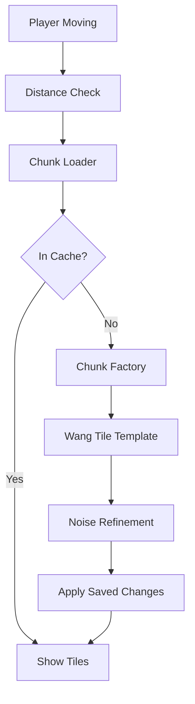

# Design: Procedural Infinite World

## Architecture Overview

系统由 `InfiniteChunkManager` (Autoload) 驱动，它监听玩家位置并管理 `TileMapLayer` 的读写。

### 1. 坐标与存储系统
- **ChunkCoord**: `Vector2i`，代表世界坐标除以 64。
- **Hash Seed**: `local_seed = hash(global_seed + chunk_coord.x * 317 + chunk_coord.y * 701)`.
- **Delta Storage**: `Dictionary[Vector2i, Dictionary[Vector2i, int]]` -> `{chunk_pos: {local_tile_pos: tile_id}}`。

### 2. 生成管线 (Generation Pipeline)
1.  **Macro Pass (MacroGenerator)**:
    - 运行一个基于波函数坍缩 (WFC) 的简化版本或简单的查表法，从 `WangTileSet` 中选择一个 64x64 模板。
    - 模板定义了基本的“硬结构”（如墙壁、出口、宝箱房坐标）。
    - **多层同步**: 宏观结构会跨图层耦合（例如：Layer 0 的矿井竖坑会延续到 Layer 1 和 2）。
2.  **Micro Pass (DensityGenerator)**:
    - 获取 `FastNoiseLite` 的密度值 $D(x, y)$。
    - 针对三层图层应用不同的噪声参数（Layer 0: 丘陵/地表；Layer 1: 密集洞穴；Layer 2: 熔岩河/硬岩）。
    - 混合公式：$FinalTile = (MacroTile > 0) \cup (D(x, y) > Threshold)$。
3.  **Visual Polish (Feedback Particles)**:
    - 挖掘 Tile 时，系统会在破坏位置生成 20-50 个基于瓦片贴图颜色的微小粒子。
    - 粒子具有简单的重力物理和随机初速度。

### 3. 数据流

## Technical Decisions
- **Threading**: 使用 Godot 的 `WorkerThreadPool` 执行 `ChunkFactory` 的计算。
- **TileMap Manipulation**: 使用 `set_cells_terrain_connect` 自动处理瓦片的位遮罩连接，确保视觉无缝。
- **Memory**: 每帧最多加载 1 个新区块，卸载超出 `visibility_radius` + 2 的区块。
