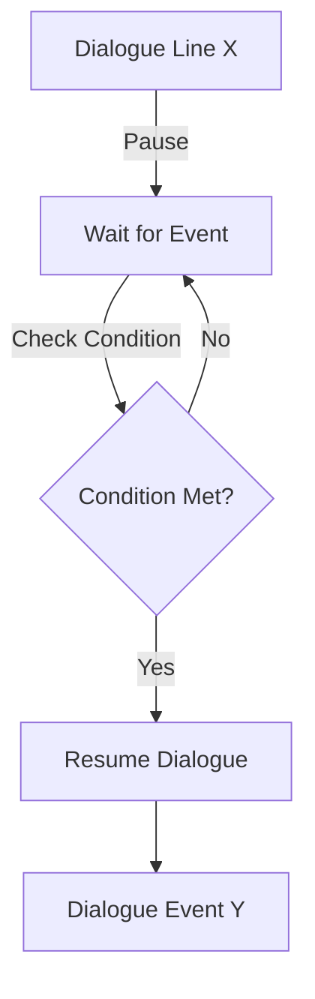

# Interactive Tutorial Design

This document details the architecture for the `Interactive Tutorial` improvement.

## Core Loop: Dialogue Pacing

Currently, dialogue continues automatically unless suspended.
We will introduce a `TutorialStep` state machine within `TutorialSequenceManager`.

## System Components

### 1. **TutorialSequenceManager (Extensions)**
- `EventBus` Listening: Must verify `inventory_opened`, `wand_equipped`, `wand_editor_opened`, `spell_logic_updated`.
- `UI Highlighting`: Request `UIManager` to flash specific buttons (inventory button, craft button).

### 2. **Input Management**
- `EventBus.player_movement_locked(locked: bool)`.
- `WandEditor` needs to emit a new signal `logic_updated` when nodes are connected/disconnected.

### 3. **Dialogue Hooks**
- New Emit Tags:
    - `<emit:wait_move>`: Wait for WASD input.
    - `<emit:wait_inventory>`: Wait for Inventory (`I`) open.
    - `<emit:wait_equip>`: Wait for Wand in Primary Slot.
    - `<emit:wait_editor>`: Wait for Wand Editor (`K`) open.
    - `<emit:wait_logic>`: Wait for valid logic connection (Trigger -> Projectile).
    - `<emit:wait_shoot>`: Wait for projectile hit on wall.
    - `<emit:highlight:ui_element>`: Trigger visual cue.
    - `<emit:crash_start>`: Final sequence.

## Narrative Flow

1.  **Intro**: Wake up on ship. Alarm sounds. Dialogue from Court Mage about the Kingdom's fall.
2.  **Move**: "Come to me." (Wait for movement).
3.  **Gift**: "Take this empty Wand and these Logic Shards." (Give `Wand`, `Trigger`, `Projectile`).
4.  **Equip**: "Equip the Wand. It is useless without logic." (Wait for Equip).
5.  **Editor**: "Open the Logic Interface (Press K)." (Wait for Editor Open).
6.  **Program**: "Drag the Trigger and Projectile into the grid. Connect them." (Wait for `logic_updated` with valid connection).
7.  **Test**: "Now fire at that panel!" (Spawn Target -> Wait for Hit).
8.  **Crash**: The ship is hit. Screen goes black. Player wakes up in the world with empty inventory (narrative reset).

## Visual Cues
- **Highlighting**: Use simple animated arrows to point at `WandEditor` buttons if possible.
- **Shake**: Camera shake intensity increases over time.
