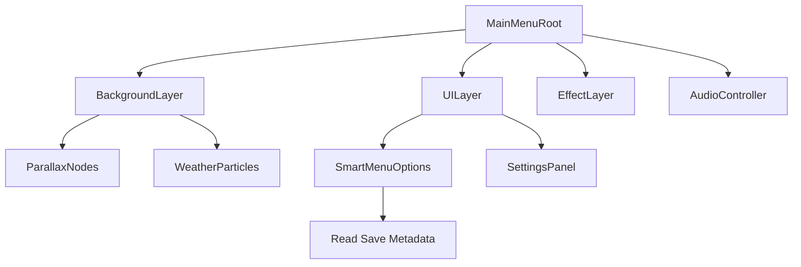

# Design: Immersive Start Menu System

## Architecture

The `MainMenu` will be refactored from a simple `Control` script into a modular composition of systems:

## detailed Components

### 1. `MainMenuSystem` (Coordinator)
*   **Responsibility**: Orchestrates the state machine (`SPLASH`, `TITLE`, `SETTINGS`, `TRANSITION`) and manages sub-systems.
*   **Lifecycle**: Preloads critical assets -> Fades in Background -> Animates UI entrance.

### 2. `DynamicBackground`
*   **Logic**:
    *   Checks `Time.get_time_dict_from_system()` to determine Day/Night/Dusk/Dawn.
    *   Instantiates different background scenes or adjusts `CanvasModulate` colors accordingly.
    *   **Parallax**: Uses `ParallaxBackground` with scroll scripts to create depth (Mountains, Forests).

### 3. `SmartMenuOptions`
*   **Logic**:
    *   Scans `SaveSystem` for the latest save file.
    *   Generates the primary action button:
        *   If no save: "Start Journey" (New Game).
        *   If save exists: "Continue - [Location]" (Load Last).
    *   Adds "New Game+" or "Gallery" based on `AchievementSystem` status.

### 4. `MenuAudio`
*   **Implementation**:
    *   Uses `AudioStreamPlayer` nodes for `Ambient` and `Melody`.
    *   `Melody` layer fades out after inactivity (Idle mode).
    *   Standardized SFX for Hover (Pitch variation) and Click.

### 5. `MenuEffects`
*   **Visuals**:
    *   `GPUParticles2D` for ambient dust (`Fireflies` at night, `Leaves` at day).
    *   **Transition**: A global `ColorRect` or `Shader` based overlay for fading to Black/White when entering the game.

## Data Flow
1.  **Init**: `MainMenu._ready()` -> `SaveSystem.get_metadata()` -> `SmartMenuOptions.build()`.
2.  **Interaction**: Button Click -> `MenuTransition.play_exit(target_state)` -> `GameManager.change_state()`.
